# Design: Draft World Editing Tools

## Problem

Agents can create draft world content (via `batch_create`, `create_resource`, `add_document`, `set_content`) but cannot read it back. The only read tool for drafts is `list_draft`, which returns summaries (id, name, tags, document_count) — no actual document content. This means:

1. Agents can't review what they wrote to iterate on it
2. Agents can't read a draft resource's content to improve it based on user feedback
3. Multi-agent workflows can't have one agent review another agent's draft output
4. There's no way to update resource metadata (name, tags, visibility, aliases) after creation — fixing a typo in a resource name requires deleting and recreating the resource, losing its ID and documents
5. Resources created with templates don't inherit the template's icon (`icon_color`, `icon_glyph`, `icon_shape`) — they always get `None`

## Constraints

- Tool-based — standard MCP tools, not MCP protocol resources
- Reuse existing `WorldBuilder` and `to_markdown()` infrastructure
- Must not break existing tool signatures or behavior
- Draft-only — new tools operate on the in-memory `WorldBuilder`, not the read-only `WorldStore`
- Content stored as ProseMirror internally; tools accept/return markdown at the API boundary

## Architecture

```mermaid
graph TD
    Agent[Agent / LLM]

    subgraph "MCP Tools (server.rs)"
        CR[create_resource / batch_create]
        SC[set_content]
        GDR[get_draft_resource ✨ NEW]
        GDD[get_draft_document ✨ NEW]
        UDR[update_draft_resource ✨ NEW]
        DD[delete_document ✨ NEW]
        LD[list_draft]
        EW[export_world]
    end

    subgraph "WorldBuilder (builder.rs)"
        WB[WorldBuilder]
        RES[root.resources: Vec&lt;Resource&gt;]
    end

    FM[format_resource&#40;&#41;]
    TM[to_markdown&#40;&#41;]

    Agent -->|"write content (markdown)"| CR
    Agent -->|"update content (markdown)"| SC
    Agent -->|"read full resource"| GDR
    Agent -->|"read single document"| GDD
    Agent -->|"update metadata"| UDR
    Agent -->|"remove document"| DD
    Agent -->|"list summaries"| LD
    Agent -->|"finalize"| EW

    CR --> WB
    SC --> WB
    GDR --> WB
    GDR --> FM
    GDD --> WB
    GDD --> TM
    FM --> TM
    UDR --> WB
    DD --> WB
    WB --> RES
```



## Interfaces

### New MCP Tools

#### `get_draft_resource`

Read a single draft resource with full content rendered as markdown. Mirrors `get_resource` (which reads from `WorldStore`) but reads from the draft `WorldBuilder`.

```rust
#[derive(Debug, Deserialize, JsonSchema)]
pub struct GetDraftResourceParams {
    /// Resource ID (8-char) or exact name (case-insensitive).
    pub id_or_name: String,
}

// Tool handler signature:
#[tool(description = "Get a draft resource by ID or name. Returns metadata and all document content rendered as markdown, matching the format of get_resource. Use this to review draft content before exporting.")]
async fn get_draft_resource(
    &self,
    Parameters(params): Parameters<GetDraftResourceParams>,
) -> Result<String, String>

// Returns: format_resource(&resource) — identical output to get_resource
// Errors:
//   - "No draft world — call create_world first"
//   - DraftResourceNotFound (via .to_string())
```

#### `get_draft_document`

Read a single document's content from a draft resource. Use when iterating on a specific document (e.g., "DM Notes") without pulling the entire resource.

```rust
#[derive(Debug, Deserialize, JsonSchema)]
pub struct GetDraftDocumentParams {
    /// Resource ID.
    pub resource_id: String,
    /// Document ID. If omitted, returns the first page document.
    pub document_id: Option<String>,
}

// Tool handler signature:
#[tool(description = "Get a single document from a draft resource. Returns the document's content as markdown with metadata. If document_id is omitted, returns the first page document.")]
async fn get_draft_document(
    &self,
    Parameters(params): Parameters<GetDraftDocumentParams>,
) -> Result<String, String>

// Returns: Document metadata (id, name, type, is_hidden) + content as markdown
// Errors:
//   - "No draft world — call create_world first"
//   - DraftResourceNotFound
//   - DraftDocumentNotFound
```

#### `update_draft_resource`

Update metadata on an existing draft resource. Does NOT update document content — use `set_content` for that.

```rust
#[derive(Debug, Deserialize, JsonSchema)]
pub struct UpdateDraftResourceParams {
    /// Resource ID to update.
    pub resource_id: String,
    /// New name for the resource.
    pub name: Option<String>,
    /// Replace all tags (full replacement, not additive).
    pub tags: Option<Vec<String>>,
    /// Update visibility (true = hidden/DM-only).
    pub is_hidden: Option<bool>,
    /// Replace all aliases (full replacement, not additive).
    pub aliases: Option<Vec<String>>,
}

// Tool handler signature:
#[tool(description = "Update metadata (name, tags, visibility, aliases) on a draft resource. Does not change document content — use set_content for that. Tags and aliases are fully replaced, not merged.")]
async fn update_draft_resource(
    &self,
    Parameters(params): Parameters<UpdateDraftResourceParams>,
) -> Result<String, String>

// Returns: DraftResourceSummary JSON (same shape as create_resource output)
// Errors:
//   - "No draft world — call create_world first"
//   - DraftResourceNotFound (via .to_string())
```

#### `delete_document`

Remove a document from a draft resource. Use to clean up unwanted documents during iteration.

```rust
#[derive(Debug, Deserialize, JsonSchema)]
pub struct DeleteDocumentParams {
    /// Resource ID.
    pub resource_id: String,
    /// Document ID to delete.
    pub document_id: String,
}

// Tool handler signature:
#[tool(description = "Delete a document from a draft resource. Cannot delete the last remaining document — every resource must have at least one.")]
async fn delete_document(
    &self,
    Parameters(params): Parameters<DeleteDocumentParams>,
) -> Result<String, String>

// Returns: Confirmation message with deleted document name
// Errors:
//   - "No draft world — call create_world first"
//   - DraftResourceNotFound
//   - DraftDocumentNotFound
//   - InvalidInput — "Cannot delete the last document on a resource"
```

### New Builder Methods

```rust
impl WorldBuilder {
    /// Look up a draft resource by ID (exact) or name (case-insensitive).
    /// Tries ID first, falls back to name — same lookup pattern as WorldStore.
    pub fn get_draft_resource(&self, id_or_name: &str) -> Result<&Resource, LkError> {
        // 1. Try exact ID match
        // 2. Fallback: case-insensitive name match
        // 3. Err(DraftResourceNotFound)
    }

    /// Get a specific document from a draft resource.
    /// If document_id is None, returns the first page-type document.
    pub fn get_draft_document(
        &self,
        resource_id: &str,
        document_id: Option<&str>,
    ) -> Result<&Document, LkError> {
        // Find resource by ID
        // Find document by ID, or first page doc if None
        // Err(DraftResourceNotFound) or Err(DraftDocumentNotFound)
    }

    /// Update non-None metadata fields on a draft resource.
    pub fn update_resource(
        &mut self,
        resource_id: &str,
        name: Option<&str>,
        tags: Option<Vec<String>>,
        is_hidden: Option<bool>,
        aliases: Option<Vec<String>>,
    ) -> Result<DraftResourceSummary, LkError> {
        // Find resource by ID
        // Apply non-None fields
        // Return updated summary
    }

    /// Delete a document from a draft resource.
    /// Fails if it would leave the resource with zero documents.
    pub fn delete_document(
        &mut self,
        resource_id: &str,
        document_id: &str,
    ) -> Result<String, LkError> {
        // Find resource by ID
        // Check document count > 1
        // Remove document, return its name
    }
}
```

### Modified Interface: Template Icon Inheritance

**File:** `src/lk/store.rs` — `get_template_properties()`

Currently returns `(Vec<Property>, Vec<String>)` (properties, tags). Needs to also return icon fields.

```rust
/// Icon fields extracted from a template resource.
pub struct TemplateIcon {
    pub icon_color: Option<String>,
    pub icon_glyph: Option<String>,
    pub icon_shape: Option<String>,
}

// Change return type:
pub fn get_template_properties(
    &self,
    world: &Option<String>,
    template_name: &str,
) -> Result<(Vec<Property>, Vec<String>, TemplateIcon), LkError>
//                                       ^^^^^^^^^^^^^ NEW
```

**File:** `src/lk/builder.rs` — `create_resource()`

Add icon parameters:

```rust
pub fn create_resource(
    &mut self,
    name: &str,
    parent_id: Option<&str>,
    tags: Option<Vec<String>>,
    content: Option<&str>,
    is_hidden: bool,
    aliases: Vec<String>,
    properties: Vec<Property>,
    icon_color: Option<String>,   // NEW
    icon_glyph: Option<String>,   // NEW
    icon_shape: Option<String>,   // NEW
) -> Result<DraftResourceSummary, LkError>
```

Then in the `Resource` construction:
```rust
icon_color,    // was: None
icon_glyph,    // was: None
icon_shape,    // was: None
```

**File:** `src/server.rs` — `create_resource()` and `batch_create()` tool handlers

When a template is resolved, extract the icon and pass it through:
```rust
let (props, template_tags, template_icon) = self.store
    .get_template_properties(&world, template_name)?;
// ...
b.create_resource(
    &name, parent_id, tags, content, is_hidden, aliases, props,
    template_icon.icon_color, template_icon.icon_glyph, template_icon.icon_shape,
)?;
```

When no template: pass `None, None, None` for icon fields.

### Existing Interfaces Used (no changes)

- `format_resource(&Resource) -> String` in `server.rs` — reused as-is to render draft resources
- `to_markdown(&Value) -> String` in `prosemirror/to_markdown.rs` — called by `format_resource`
- `DraftResourceSummary` — returned by `update_resource`, same struct as `create_resource` output

## Data Flow

### Iterative editing workflow

```
1. Agent creates draft content:
   batch_create(resources: [...])  →  WorldBuilder stores ProseMirror JSON
                                      template icons copied to resources

2. Agent (or user) wants to review:
   get_draft_resource("Captain Reef")  →  builder.get_draft_resource() returns &Resource
                                        →  server calls format_resource() → to_markdown()
                                        →  agent reads rendered markdown

3. User gives feedback: "Make the DM Notes more detailed"
   get_draft_document(resource_id, doc_id)  →  read just the DM Notes document
   set_content(resource_id, doc_id, updated_markdown)  →  revise it

4. Agent verifies:
   get_draft_document(resource_id, doc_id)  →  confirm DM Notes look right

5. User says: "Remove that History document, it's not needed"
   delete_document(resource_id, history_doc_id)  →  removed

6. User says: "Rename to Captain Ironreef and add the 'villain' tag"
   update_draft_resource(resource_id, name: "Captain Ironreef", tags: ["npc", "villain"])

7. Agent finalizes:
   export_world()  →  .lk file with all revisions
```

### Multi-agent review workflow

```
1. Generator agent: batch_create(resources: [...])
2. Reviewer agent:  get_draft_resource(id) for each resource
                    get_draft_document(id, doc_id) for targeted review
                    → provides feedback
3. Generator agent: set_content() / update_draft_resource() / delete_document()
4. Loop steps 2-3 until quality bar met
5. export_world()
```

## Key Decisions

| Decision | Chosen | Rejected | Why |
|----------|--------|----------|-----|
| Tags/aliases semantics | Full replacement | Additive (add/remove) | Simpler API — agent provides complete desired state. No need for separate add/remove params. |
| Output format for get_draft_resource | Reuse `format_resource()` | New format | Identical output to `get_resource` — agent sees consistent markdown regardless of source (stored vs draft). Zero new formatting code. |
| Lookup pattern | ID-first, name-fallback | ID-only | Agents reference resources by name in conversation. Consistency with `get_resource` reduces cognitive load. |
| Formatting layer | Server (format_resource) | Builder returns markdown | Builder is data layer. Formatting belongs at the API boundary. Matches existing split: `WorldStore` returns `Resource`, `server.rs` calls `format_resource()`. |
| Update scope | Metadata only | Metadata + content | `set_content` already handles content updates. Combining would create a tool with too many optional params. |
| Template icon inheritance | Copy icon fields from template | Always use None | Templates define the visual identity of resource types. An NPC template with a person icon should produce NPC resources with that icon. |
| Icon field propagation | Add to `get_template_properties` return type | Separate method | Keep the existing call site pattern. One method returns everything about a template (properties, tags, icon). |
| Delete document guard | Prevent deleting last document | Allow orphaned resources | Every LK resource must have at least one document. Allowing zero-document resources would produce invalid `.lk` files. |

## Invariants

1. `get_draft_resource` output is identical in format to `get_resource` output for the same underlying `Resource` data — both call `format_resource()`
2. `update_draft_resource` never modifies document content — only resource-level metadata (name, tags, is_hidden, aliases)
3. ID-first, name-fallback lookup in `get_draft_resource` matches `WorldStore::get_resource` behavior exactly
4. `update_resource` with all-None optional fields is a no-op that returns the current summary
5. Every resource always has at least one document — `delete_document` enforces this
6. Resources created with a template inherit the template's icon fields (color, glyph, shape)

## Open Questions

None — this design is self-contained and builds entirely on existing patterns.
