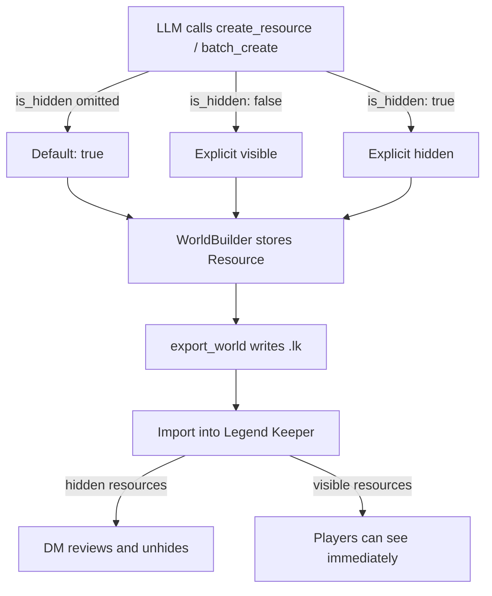

# Design: Default Resources to Hidden on Export

## Problem

When the LLM generates a world and exports it as a `.lk` file, all resources default to `isHidden: false`. If the DM imports this file into Legend Keeper without reviewing every resource, players can immediately see all generated content — including content the DM hasn't vetted. The safe default is hidden: the DM unhides resources in Legend Keeper as they review them.

## Constraints

- Must not affect **read** behavior — existing `.lk` files loaded from disk are unchanged
- Must not affect how the server annotates or filters hidden content
- Documents and properties on a resource do NOT need to be hidden independently — when a resource is hidden, its entire subtree (documents, properties) is invisible in player mode
- The LLM must still be able to explicitly make a resource visible (`is_hidden: false`)
- No new CLI flags or config — this is a default change, not an option

## Architecture



No new components. This is a default-value change at the API boundary.

## Interfaces

### External APIs (MCP Tools)

No new tools. Four existing default values change:

**`create_resource`** — `is_hidden` parameter:
```
Before: is_hidden: Option<bool>  // defaults to false when omitted
After:  is_hidden: Option<bool>  // defaults to true when omitted
```

**`batch_create`** — `BatchResourceSpec.is_hidden`:
```
Before: is_hidden: Option<bool>  // defaults to false when omitted
After:  is_hidden: Option<bool>  // defaults to true when omitted
```

**`add_document`** and `BatchDocumentSpec.is_hidden` — **unchanged** (stay default false). Documents don't need independent hiding because resource-level hiding covers them. When the DM unhides a resource in Legend Keeper, the main document should be visible.

### Internal Interfaces

**`src/server.rs`** — 2 call sites change their `unwrap_or`:

```rust
// create_resource handler (line ~374)
// Before:
params.is_hidden.unwrap_or(false)
// After:
params.is_hidden.unwrap_or(true)

// batch_create handler (line ~508)
// Before:
spec.is_hidden.unwrap_or(false)
// After:
spec.is_hidden.unwrap_or(true)
```

**`src/lk/builder.rs`** — No changes. The builder already accepts `is_hidden: bool` as a parameter. It doesn't set defaults.

**Tool descriptions** — Update the JSON Schema descriptions:

```rust
// CreateResourceParams.is_hidden
/// Mark this resource as hidden (DM-only). Defaults to true — resources are
/// hidden on export so the DM can review before showing to players.

// BatchResourceSpec.is_hidden
/// Mark this resource as hidden (DM-only). Defaults to true — resources are
/// hidden on export so the DM can review before showing to players.
```

**Server instructions** — Update the `instructions` string in `server.rs` to mention that generated resources are hidden by default.

### Data Schemas

N/A — no schema changes. `Resource.is_hidden` field is unchanged.

## Data Flow

### Creating a resource (omitting is_hidden)

1. LLM calls `create_resource(name: "Tavern")` — no `is_hidden` parameter
2. `server.rs` receives `CreateResourceParams { is_hidden: None, ... }`
3. `params.is_hidden.unwrap_or(true)` → `true`
4. `builder.create_resource(..., is_hidden: true, ...)` stores hidden resource
5. `export_world()` writes resource with `isHidden: true`
6. DM imports into Legend Keeper → resource is hidden → DM unhides after review

### Creating a visible resource (explicit is_hidden: false)

1. LLM calls `create_resource(name: "Welcome Page", is_hidden: false)`
2. `server.rs` receives `CreateResourceParams { is_hidden: Some(false), ... }`
3. `params.is_hidden.unwrap_or(true)` → `false` (explicit value wins)
4. `builder.create_resource(..., is_hidden: false, ...)` stores visible resource
5. `export_world()` writes resource with `isHidden: false`
6. DM imports into Legend Keeper → resource is immediately visible to players

## Key Decisions

| Decision | Chosen | Rejected | Why |
|----------|--------|----------|-----|
| Where to apply the default | At the API boundary (`unwrap_or(true)`) | Export-time pass that hides all resources | Simpler, more transparent — the LLM sees the actual state as it builds. An export-time override would be surprising and make `list_draft` output misleading. |
| Hide documents too? | No — leave documents at default false | Hide all documents | Resource-level hiding is sufficient (player mode filters the whole resource). When DM unhides a resource, the main document should be visible without extra steps. |
| Respect explicit `is_hidden: false`? | Yes — explicit false is honored | Override all to hidden at export | The LLM should be able to create player-facing content intentionally. The safety net is the *default*, not a forced override. |
| Add a parameter to control the default? | No — always default to hidden | `export_world(hide_all: bool)` | Over-engineering. If the user wants visible resources, they tell the LLM to set `is_hidden: false`. No config needed. |

## Invariants

1. **Omitting `is_hidden` always produces a hidden resource** — `unwrap_or(true)` in both `create_resource` and `batch_create`
2. **Explicit `is_hidden: false` always produces a visible resource** — `Option::unwrap_or` respects `Some(false)`
3. **Document defaults are unchanged** — documents still default to `is_hidden: false`
4. **Read tools are unaffected** — this only changes the generation path

## Open Questions

None — this is a straightforward default change.
